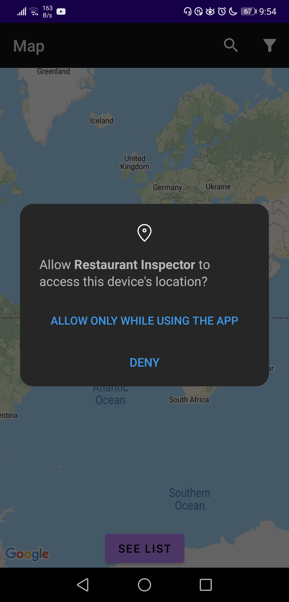
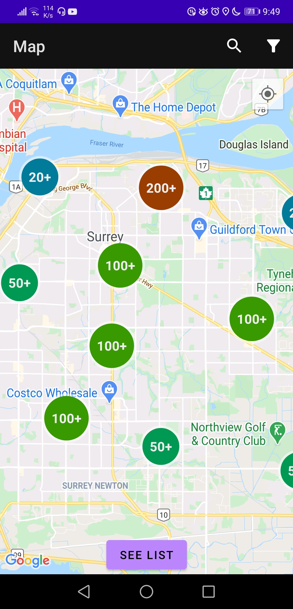
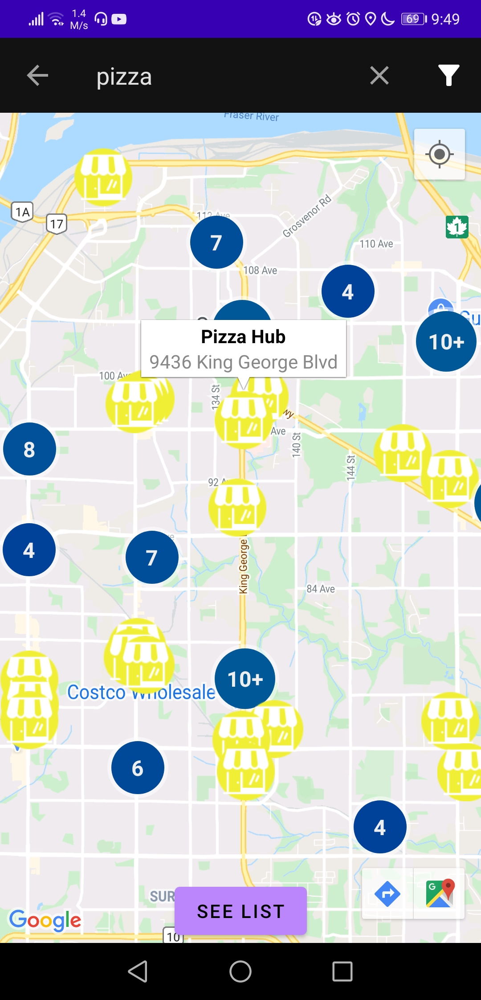
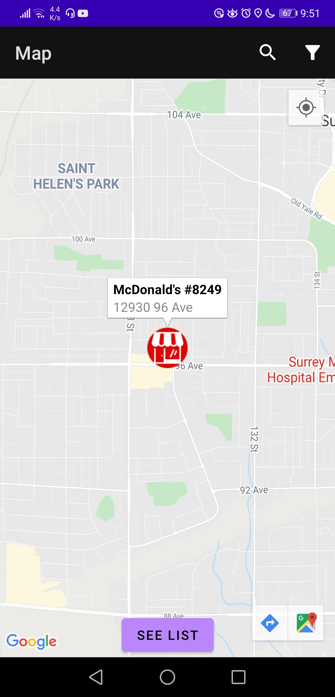
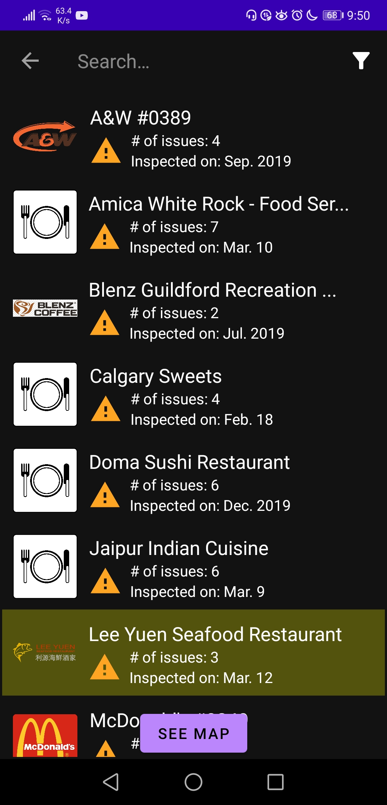
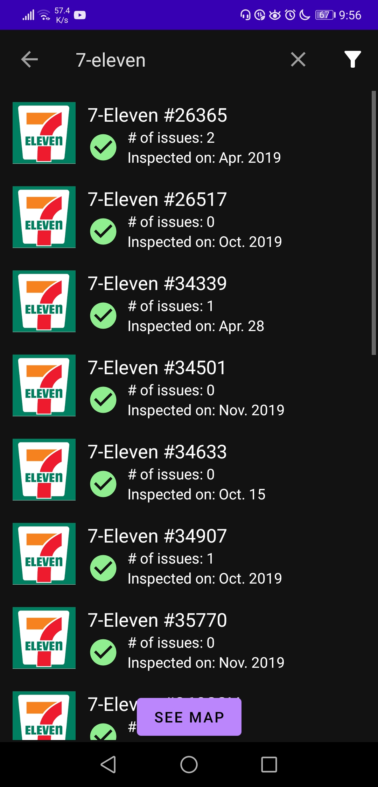
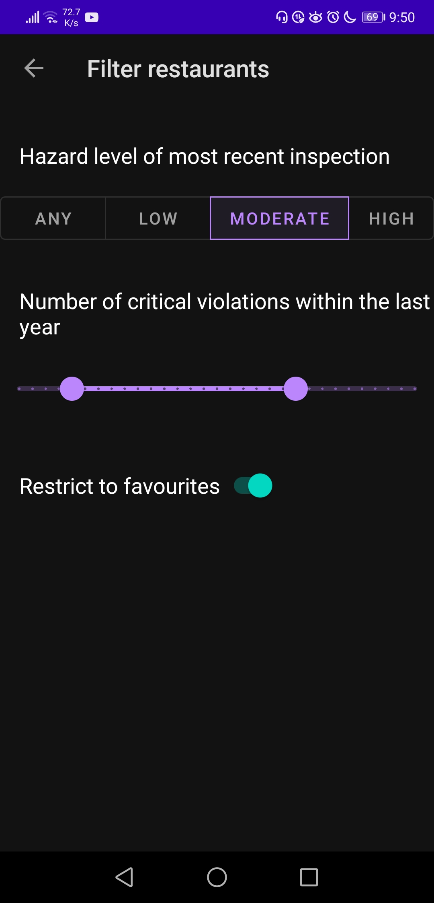
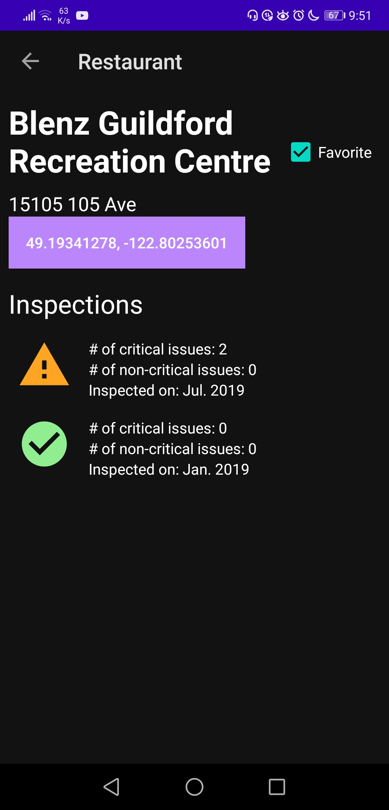
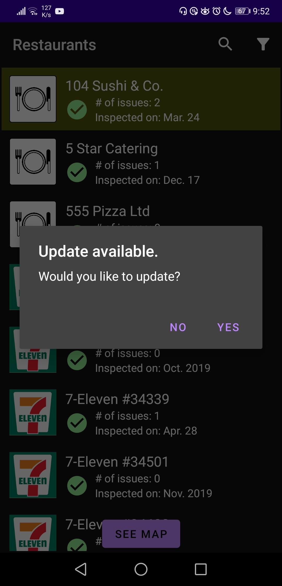
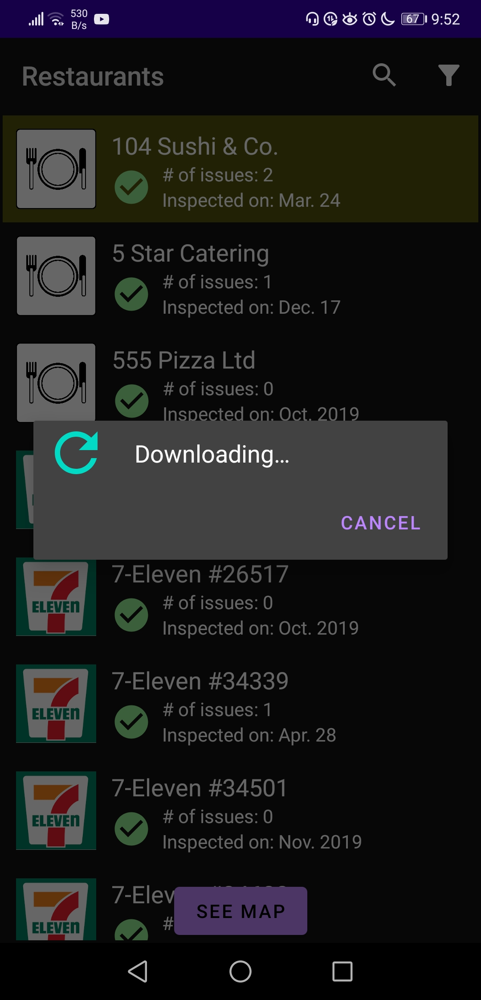

# Restaurant Inspection App

 Android app to browse restaurant health inspections in the Surrey region. 
 The app fetches inspection data from City of Surrey's Open Data API and displays it in a scrollable list and a map view using Google Maps API.
 
 ## Installation

1. Clone this repository and import into **Android Studio**
   ```bash
   git clone https://github.com/01mz/restaurant-inspection-app.git
   ```
2. Use your own Google API key in `res/values/google_maps_api.xml`. 
   ```
   <string name="google_maps_key" templateMergeStrategy="preserve" translatable="false">YOUR_API_KEY</string>
   ```
   You must have the Google Maps Android API enabled for your API key.

## Screenshots

Map view with search and filter
<br> 







<br> 
Scrollable list with search and filter. Favorited restaurants are highlighted
<br>


<br>
Filter restaurants by hazard level, number of violations, or favorites
<br>

<br>
Restaurant details
<br>

<br>
Update inspection data
<br>


<br>
 
_More screenshots in `images` folder_
